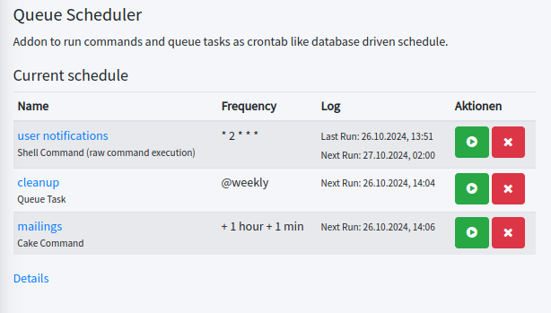

# CakePHP QueueScheduler plugin

[](https://github.com/dereuromark/cakephp-queue-scheduler/actions/workflows/ci.yml)
[](https://codecov.io/github/dereuromark/cakephp-queue-scheduler/branch/master)
[](https://packagist.org/packages/dereuromark/cakephp-queue-scheduler)
[](https://php.net/)
[](https://phpstan.org/)
[](LICENSE)
[](https://packagist.org/packages/dereuromark/cakephp-queue-scheduler)
[](https://github.com/php-fig-rectified/fig-rectified-standards)

A scheduler addon for [Queue plugin](https://github.com/dereuromark/cakephp-queue).

This branch is for use with **CakePHP 5.1+**. For details see [version map](https://github.com/dereuromark/cakephp-queue-scheduler/wiki#cakephp-version-map).

## Motivation
A DB and queue based cronjob system does not require a sys-admin to manually modify the crontab file on a server.
It also allows for easier multi-server (worker) environments.

Such a system provides easier input and "frequency" validation, as well as visual output of the schedule in the backend.
For smaller projects it can also be ported more easily between systems (e.g. dev/stage/prod) using migrations
instead of having to touch the server config.

Also logging and i18n customization can potentially be easier to get addressed this way.

Finally, with the Queue plugin integrating it can smoothly work alongside your existing Queue tasks.
Any failed job (e.g. network issue, or email SMTP issue) can be automatically re-run x times as per config.

Further features:
- Concurrency handling: Decision in case a job is still running or failed in queue, if it will run now ones or just skip.
- The backend can provide buttons to also "trigger" any scheduled job manually where needed.
- Autocomplete or proposals based on available Cake commands or Queue tasks.



## Installation

You can install this plugin into your CakePHP application using [composer](https://getcomposer.org).

```
composer require dereuromark/cakephp-queue-scheduler
```

## Installation and Usage
See [Documentation](docs/).

## Credit where credit is due
This plugin is heavily inspired by [LordSimal Scheduler plugin](https://github.com/LordSimal/cakephp-scheduler)
and [Laravel Task Scheduling Feature](https://laravel.com/docs/10.x/scheduling).

Use this Scheduler plugin if you prefer configuring them file-based and purely in crontab style.
